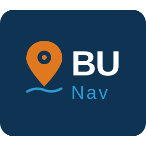

# BUNav — Bicol University Navigation System

  

A full-stack, React-based 3D campus navigation application built with Mapbox GL, Node.js, and MongoDB. BUNav provides students, faculty, and visitors with interactive mapping, turn-by-turn directions, real-time location tracking, and an extensive directory of buildings and points of interest across Bicol University campuses.

---

## Key Features

### Map & Navigation
- **Interactive 3D Map** — Fluid map rendering with switchable 2D/3D perspective powered by Mapbox GL.
- **Turn-by-turn Navigation** — Calculates walking, cycling, or driving routes between your location and any destination using the Mapbox Directions API.
- **Real-time GPS Tracking** — Follows your movement live on the map and automatically advances navigation steps as you move.
- **Campus Auto-zoom** — Clicking a campus name at the overview zoom level flies the map into that campus boundary.

### Search & Discovery
- **Global Search Bar** — Find campuses, buildings, gates, and points of interest by name. Supports partial matching and deduplication.
- **Building Directory** — Every searchable building shows its campus name and, when clicked, opens a popup with building metadata and a navigation option.
- **POI List Panel** — Toggle visibility of individual POI categories (e.g., Main Gates, canteens) from a side panel without removing them from the database.

### Location Sharing
- **Share a Location** — Click anywhere on the map (outside of buildings and POI markers) and a popup appears showing the coordinates as a shareable `@loc:lat,lng` string. Click **Copy Location** to copy it to clipboard.
- **Paste to Navigate** — Paste a `@loc:` string directly into the search bar. The map instantly flies to those coordinates, drops a pin, and opens the navigation popup so you can route to the shared location.
- **Toggle On/Off** — The pin icon in the toolbar enables or disables the location sharing feature. When disabled, map clicks no longer open the share popup.

### Points of Interest
- **Custom POI Pins** — Drop color-coded pins anywhere on the map with a custom label and save them to the database.
- **Persistent Storage** — All custom buildings and POIs survive page refreshes via the Express/MongoDB backend.

### Toolbar Controls
The right-side toolbar is collapsible. The **+** and **−** zoom buttons are always visible. The chevron button below them expands or collapses the rest of the controls:

| Button | Function |
|--------|----------|
| Reset North | Resets the map bearing and pitch to north-up 2D |
| Locate Me | Triggers the GPS geolocate control |
| 3D | Toggles between 3D (pitched) and flat 2D view |
| POI | Opens/closes the POI List Panel |
| Pin icon | Enables/disables location sharing on map click |
| Info | Opens the app information modal |
